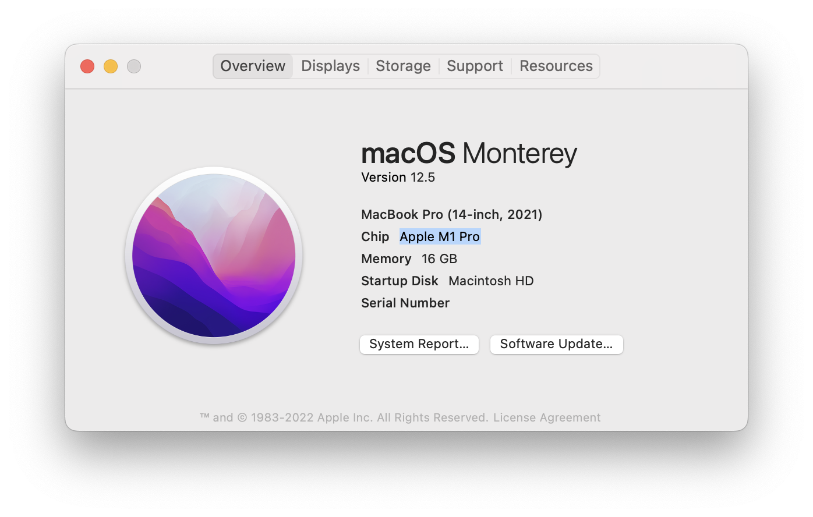
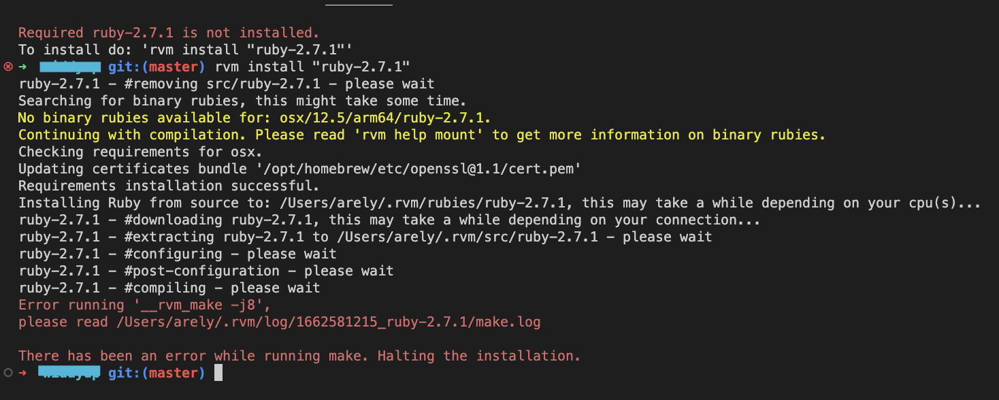
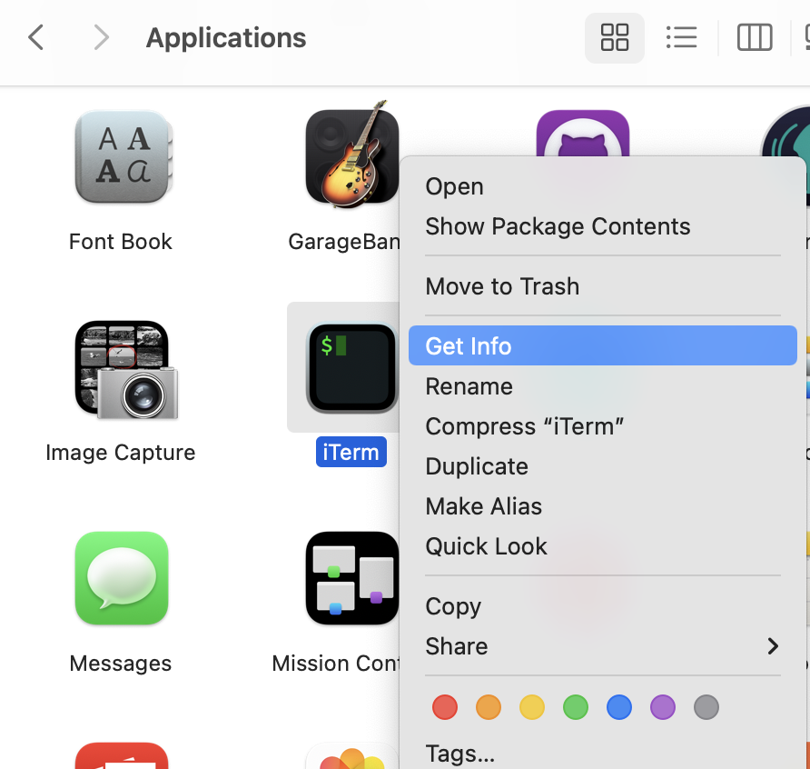
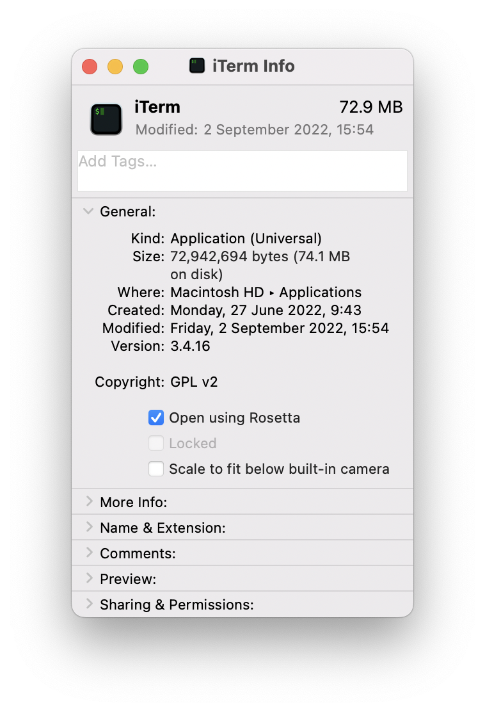
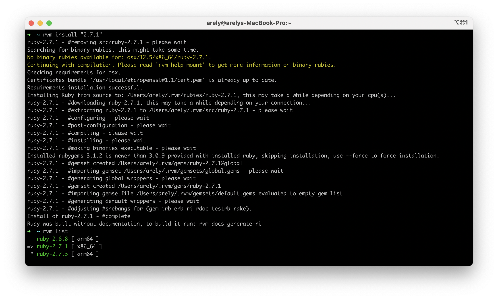

# 1. How to install any ruby versions on MacBook Pro with Chip Apple M1 Pro

You can know what Chip has on your Mac by going to the Apple icon at the top-left of the screen and then clicking on `About this Mac`. You'll see a modal like below:

## System specifications


## The current problem:

The new Macs with chip `Apple M1 Pro` by default use ARM architecture, and some ruby versions are only available in x86 architecture. 

So, when you try to install some ruby versions with a package manager like `rvm` or `rbenv`, you will see this error message:



## The solution

You have to make your system work with x86 architecture in the background by using Rosetta.

1. Go to Finder > Application folder
2. Right-click on your favorite Terminal application and select Get Info



3. Select Open using Rosetta

If you don't see this option, you need to install `Rosseta` first with:

```
softwareupdate --install-rosetta --agree-to-license
```

4. Then open your favorite Terminal to [Uninstall Homebrew](https://github.com/homebrew/install#uninstall-homebrew)

If there is the error "Failed to locate Homebrew!" you should remove the files manually with:

```
rm -rf /opt/homebrew/*
sudo rm -rf /opt/homebrew
```

5. And then re-[installl Homebrew](https://github.com/homebrew/install#install-homebrew-on-macos-or-linux)

6. Restart the terminal
7. Check if Homebrew is working fine: `brew doctor`
8. Reinstall openssl: `brew install openssl`
9. Install Ruby with your version manager:
`rvm install "2.7.1"` or any version you want


As you can see I had other ruby versions installed before and they were installed using ARM architecture and the new one was installed with x86.
