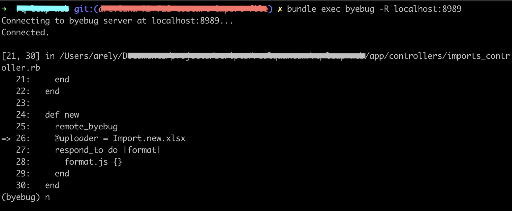

# 2. Add byebug as remote process

Sometimes you will work on ruby ​​projects that use a tool to initialize the local server and its dependencies like `pow` or `foreman`, in that case, you won't be able to use `byebug` as usual because you will only see a console running with all the running processes of your project and if you try to use the `byebug` command, your console will stop at the selected line, but you won't be able to see anything you type and that's really annoying.

So let me show you step by step how to start a different process to get access to the `byebug` console correctly.
First of all note that Byebug gem already has a configuration to start a remote process that runs by default on port `8989`, so we **don't need to add any extra configuration**.

For this example, we are going to work on a project that uses the `foreman` process manager.

1. Add the [byebug gem](https://rubygems.org/gems/byebug/versions/9.0.6) to your `Gemfile`.
2. Type the word `remote_byebug` anywhere you want to stop the code.

3. Start the web server as usual using `foremant start`.

4. (Optional) You can verify that the process on port `8989` has not started yet, it will start the moment your code reaches the `remote_byebug` line.

5. Make it necessary through the web page to hit the `remote_byebug` command and the server will stop at that line (Now the byebug process has been initialized).

6. Open the `byebug` console in a different terminal by typing `bundle exec byebug -R localhost:8989` and you can interact with your code like this:

